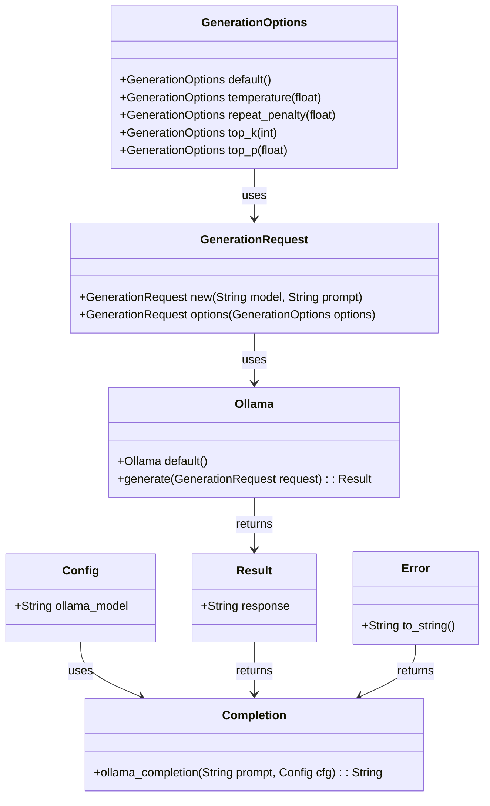

## IDEA cli


> **UPDATE** Added Ollama Support!

> CLI tool to generate short ideas into your Obsidian Vault.  
> Read the [blog post](https://medium.com/@rene.krewinkel/that-i-love-the-command-line-is-no-secret-to-the-ones-who-know-me-nor-that-i-build-my-own-511d8ed255ea) 

## Config
Add to your .env file or environment vars

```dotenv
VAULT_PATH=/full/path/to/your/vault
OPENAI_TOKEN=openai-token
OPENAI_URL=https://api.openai.com/v1/
OPENAI_MODEL=gpt-3.5-turbo
USE_OLLAMA=YES|NO
OLLAMA_MODEL=llama2:latest
YOUTUBE_TOKEN=youtube-token-not-used-yet
```

## TO DO
- [x] ~~[Better error handling](https://github.com/ReneKrewinkel/idea-cli/issues/1).~~
- [x] ~~[Check if there are video's if not, don't generate the content](https://github.com/ReneKrewinkel/idea-cli/issues/2)~~
- [ ] [Use Official youtube library: google-youtube3](https://github.com/ReneKrewinkel/idea-cli/issues/3)
- [x] ~~[Integrate in NeoVim (NeoVim plugin!) **FEATURE**](https://github.com/ReneKrewinkel/idea-cli/issues/4)~~
- [ ] [Generic config file in](https://github.com/ReneKrewinkel/idea-cli/issues/5) `${HOME}/.config/idea-cli/settings.json`
- [x] ~~[Option for using Ollama instead of OpenAI](https://github.com/ReneKrewinkel/idea-cli/issues/6)~~
- [ ] [Write tests](https://github.com/ReneKrewinkel/idea-cli/issues/7)
- [x] ~~[fix the `unwrap` in the completion](https://github.com/ReneKrewinkel/idea-cli/issues/8)~~
- [ ] [Strange behaviour in the return of the completion. somehow the string isn't trimmed properly returns a `\\u0000-\\u001F`](https://github.com/ReneKrewinkel/idea-cli/issues/9)
- [x] ~~[***Optimize code!!!!!***](https://github.com/ReneKrewinkel/idea-cli/issues/10)~~
- [x] ~~[Make sure not to overwrite a file](https://github.com/ReneKrewinkel/idea-cli/issues/11)~~
- [x] ~~[Add tags based upon input](https://github.com/ReneKrewinkel/idea-cli/issues/12)~~
- [x] ~~[Write neovim plugin](https://github.com/ReneKrewinkel/idea-cli/issues/13)~~
- [ ] [Convert returns to `Result<T,E>`](https://github.com/ReneKrewinkel/idea-cli/issues/14)
 
## Build
#### MacOS
```shell
cargo build --target=aarch64-apple-darwin --release
```

#### Windows
```shell
cargo build --target x86_64-pc-windows-gnu
```
## NeoVim plugin

Check out the [Neovim plugin](./neovim-plugin/README.md)


